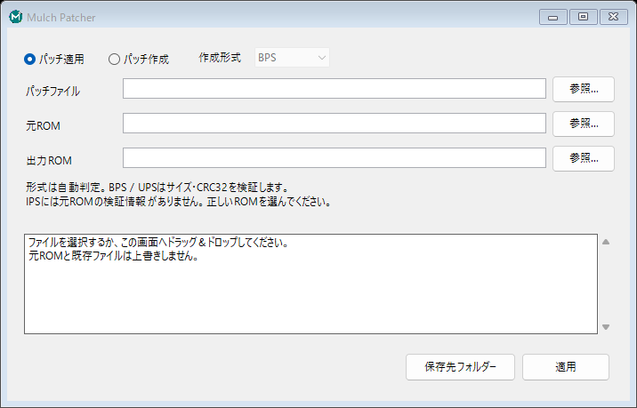

# Mulch Patcher

WinIPSと同じ404×162ピクセルの小さな画面で、**IPS / BPS / UPS** の適用と作成ができるWindows用パッチャーです。
元ROMは保持し、処理結果を新しいファイルとして保存します。



## ダウンロード

[Releases](https://github.com/pit-true/mulch-patcher/releases/latest) の `MulchPatcher.exe` をダウンロードして実行してください。
Windows 10 / 11、.NET Framework 4.8で動作します。

## パッチ適用

1. 「パッチ適用」を選択します。
2. パッチファイルと元ROMを指定します。参照ボタン、パス入力、ドラッグ＆ドロップが使えます。
3. 「適用」を押します。保存先は自動生成され、完了ダイアログに表示します。

## パッチ作成

1. 「操作」から「BPSパッチ作成」「UPSパッチ作成」「IPSパッチ作成」を選択します。
2. 変更前のROMと変更後のROMを指定します。
3. 「作成」を押します。変更後ROMのフォルダーに「変更後ROM名＋パッチの拡張子」で保存します。

| 形式 | 元ROMの検証 | 16 MiB → 32 MiB | 用途 |
| --- | --- | --- | --- |
| BPS | サイズ・CRC32 | 対応 | 通常の配布用。初期選択 |
| UPS | サイズ・CRC32 | 対応 | NUPSとの互換、逆適用 |
| IPS | なし | 非対応 | 従来のIPSツールとの互換 |

## コマンドライン

```powershell
MulchPatcher.exe --apply "hack.bps" "original.gba" "patched.gba"
MulchPatcher.exe --create bps "original.gba" "modified.gba" "hack.bps"
MulchPatcher.exe --create ups "original.gba" "modified.gba" "hack.ups"
MulchPatcher.exe --create ips "original.gba" "modified.gba" "hack.ips"
```

パッチをEXEへドラッグ＆ドロップしてGUIを開くこともできます。
PowerShellで終了まで待ちたい場合は `Start-Process -Wait -PassThru` を使ってください。

## 調査・ライセンス

動作を調べた既存ツールとフォーマット仕様は [docs/research.md](docs/research.md) にまとめています。
アプリ本体はC#で実装し、Flips・WinIPS・NUPSのバイナリは配布物に含めません。

Copyright (c) 2026 pit-true. [GPL-3.0-or-later](LICENSE).
